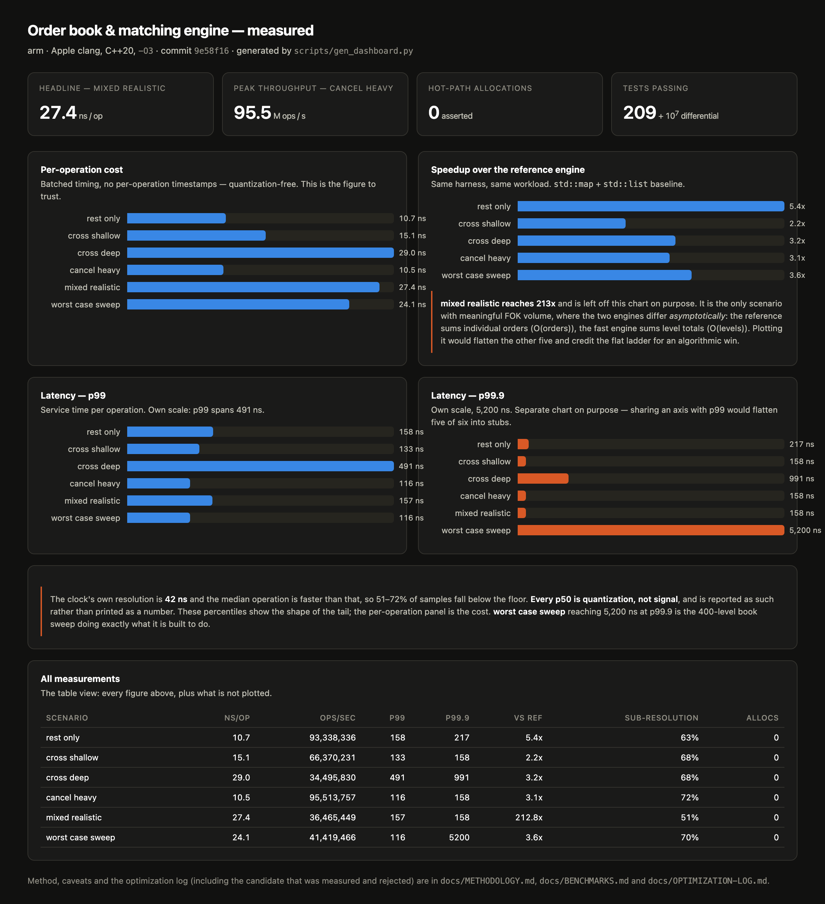

# Market replay engine and research stack

A limit order book in C++20, run two ways: as a **matching engine** that decides fills,
and as a **reconstruction engine** that rebuilds the book from real Nasdaq ITCH 5.0
data. On top of it sits a Python research layer and an MCP server, so an LLM can ask
questions about real market data and get answers grounded in numbers the tools
computed.

**Status: all eight phases complete.**

| | Part | What it is |
|---|---|---|
| **I** | [Matching engine](#part-i--the-matching-engine) | Price-time priority, five order types, 28.8 ns/op, differential-tested against a reference over 10<sup>7</sup> operations |
| **II** | [ITCH replay](#part-ii--itch-replay-on-real-nasdaq-data) | Decodes all 22 ITCH 5.0 message types and rebuilds the book for real symbols, verified against the exchange's own executions |
| **III** | [Research layer](#part-iii--the-research-layer) | pybind11 bindings and a signal evaluation that reaches a **negative** conclusion with the evidence attached |
| **IV** | [MCP agent](#part-iv--the-mcp-research-agent) | Four tools that return structured evidence rather than prose |

The distinction between Parts I and II is the one that matters most and is the easiest
to get wrong. **A matching engine decides which orders trade. A reconstruction engine is
told.** ITCH carries the exchange's own `OrderExecuted` messages, so replay applies
events rather than making decisions — it never crosses a book, never picks a
counterparty, and never invents a fill. The storage, the tests and the measurement
harness carry over; the matching logic does not, and stays a separate capability.

---

## Results



Generated from the measured results by `scripts/gen_dashboard.py --png`, never
hand-edited, so the dashboard cannot drift from the runs that produced it. Open
[`docs/dashboard.html`](docs/dashboard.html) for the interactive version.

## Quickstart

```bash
brew install cmake ninja                       # macOS; skip if already present
cmake -S . -B build -G Ninja -DCMAKE_BUILD_TYPE=Release \
      -DOB_BUILD_BENCH=ON -DOB_BUILD_TOOLS=ON
cmake --build build
ctest --test-dir build
```

Then, for the matching engine:

```bash
./build/bench/ob_bench_throughput --ops 2000000
./build/tools/ob_replay --scenario mixed_realistic --ops 200000 --rate 5000 --tui
```

For real market data — the ITCH file is 3.5 GB compressed, so this is a deliberate step:

```bash
./scripts/fetch_itch.sh 12302019                      # md5-verified download
./build/tools/ob_itch_stat  --in data/12302019.NASDAQ_ITCH50
./build/tools/ob_replay_itch --in data/12302019.NASDAQ_ITCH50 \
        --symbols AAPL,MSFT,SPY,INTC,QQQ --oracle
```

The committed 10 MB slice in `testdata/` means the test suite and CI run against genuine
exchange bytes without needing the full download.

---

# Part I — The matching engine

Price-time priority, integer tick prices, deterministic sequenced output.

- Five order types: `Limit`, `Market`, `Ioc`, `Fok`, `PostOnly`, plus `Cancel`
- Trades print at the **maker's** price
- No floating point touches a price or quantity anywhere, including in the tests
- Every failure is a typed reason code, and a failed command leaves the book
  bit-for-bit unchanged

### Performance

Median of 5 independent runs; a run with over 10% spread is rejected, not published.
Full method and caveats in [`docs/BENCHMARKS.md`](docs/BENCHMARKS.md).

| scenario | engine ns/op | throughput | p99 | p99.9 |
|---|---|---|---|---|
| `mixed_realistic` (headline) | **28.8** | **34.8 M ops/s** | 148 ns | 190 ns |
| `cancel_heavy` | 9.8 | 102.5 M ops/s | 107 ns | 149 ns |
| `rest_only` | 7.7 | 129.6 M ops/s | 149 ns | 232 ns |
| `cross_deep` | 25.7 | 39.0 M ops/s | 482 ns | 1,024 ns |
| `worst_case_sweep` | 25.1 | 39.9 M ops/s | 107 ns | 5,440 ns |

**Zero allocations** in every measured window, asserted by a replaced `operator new`
that fails the run if the counter moves.

Four things stated up front rather than buried:

- **Against the reference implementation the honest speedup is 2.7x to 10.8x.** One
  scenario shows 195x, but that is a single asymptotic difference in the FOK pre-scan
  (O(levels) versus O(orders)), not the flat ladder. Attributing it to the data
  structures would be misleading.
- **The one optimization that landed came from a failure.** Identity hashing in the ID
  index was 35–67% faster on five scenarios and 281% *slower* on the sixth, because
  mapping consecutive IDs to consecutive buckets makes backward-shift deletion O(run
  length). Understanding that produced a blocked hash, faster on all six, −30.3%
  overall. Both are in [`docs/OPTIMIZATION-LOG.md`](docs/OPTIMIZATION-LOG.md),
  including the rejected one.
- **The CI instruction-count gate cannot see that optimization.** The blocked hash
  executes more instructions while running faster, so the gate reads it as a regression.
  A deterministic metric is worth having on a shared runner, and this is what it costs.
- **The clock cannot resolve one operation.** Measured granularity is 42.000 ns against
  a ~29 ns operation, so per-operation cost comes from an untimestamped batched loop and
  the percentiles carry an explicit floor.

No number here comes from a hardware performance counter, because none is accessible on
this hardware, in Docker, or on GitHub runners. Cache and branch figures elsewhere are
Cachegrind *simulations* and say so.

### Live view

```
  ORDER BOOK   seq 93
     10002         526     9  ##################################
     10001         165     3  ##########
     10000          62     1  ####
  ------- spread 1 -------
      9999         162     5  ##########
      9998         283     5  ##################

  commands 72           trades 8             2.0 K ops/s   ctrl-c to quit
```

The render thread reads a **seqlock**: the matching thread publishes a top-15 depth
snapshot and never waits for a reader. A reader that stops entirely is
indistinguishable from one that never existed — and that is a test
(`tests/test_publisher_isolation.cpp`), not a comment, because it is the only thing
that makes attaching a viewer to a latency-sensitive engine defensible.

Measured: no reader 9.33 M ops/s, reader killed mid-publication 7.72 M, reader spinning
hard 5.00 M. The seqlock guarantees the writer never *waits*; a reader still competes
for a core and memory bandwidth, which is what the second and third numbers show.

### Order entry over the wire

A fixed-layout little-endian binary protocol, ITCH/OUCH in shape, with the length in the
header so a decoder can skip an unknown message instead of losing frame sync. With a
deliberately small 1,000-byte buffer, 200,000 messages produced **4,115 buffer
straddles** and still ended with a book byte-identical to the in-process path. That
equivalence is an automated test.

---

# Part II — ITCH replay on real Nasdaq data

Real [Nasdaq TotalView-ITCH 5.0](https://emi.nasdaq.com/ITCH/Nasdaq%20ITCH/) sample
files: public, free, md5-verified. One trading day is about 3.5 GB compressed, 8.5 GB
raw, roughly 300 M messages.

### The decoder

All 22 message types. **Every body size was verified against real bytes rather than
read from the specification** — 354,869 messages decoded from the committed slice with
**zero mismatches and zero errors**, bytes consumed exactly equal to file size.

Everything on the wire is big-endian and packed. The common header is 11 bytes, and the
timestamp is **six** bytes, which has no primitive type — it is read as one 4-byte plus
one 2-byte big-endian load, touching exactly six bytes. Loading eight and masking would
be shorter and would read two bytes past any message whose last field is the timestamp.

Hardening, because this is the only code that touches untrusted bytes:

| Check | Result |
|---|---|
| Truncation sweep, 20,001 prefix lengths | No overread under ASan |
| Mid-message truncation, **204,775 cases** | Every one refused with `consumed == 0` |
| 200,000 random buffers | All typed errors, no overrun, no hang |
| 200,000 single-byte corruptions, re-walked | Always terminated |
| libFuzzer | Zero crashes |

A frame longer than any known message is **skipped, not fatal** — if Nasdaq adds a
60-byte type, replay continues. Only an absurd length declares desync.

### Book reconstruction

One book per tracked symbol, routed by `stock_locate` through a 64 KB lookup table so
the filter costs one load on all ~300 M messages while the books run on a few million.

**The structure is a flat one-cent ladder plus an overflow map, and the overflow path is
ordinary traffic rather than a safety net.** The reason is a measurement that
contradicted the original design:

> The median symbol's price span is **19,999,998 cents — $199,999.98** — and 6,557 of
> 8,892 symbols exceed the 65,536-level ladder. Market makers satisfy two-sided quoting
> obligations by resting stub quotes near $0.01 and $200,000, so every symbol has them.
> Occupancy is a different story entirely: the worst of ten liquid symbols peaked at
> **5,086 distinct live levels**. The window holds the real market comfortably; the tail
> goes to a map.

Measured out-of-window rate, as a share of adds: BAC 0.002%, QQQ 0.003%, SPY 0.004%,
MSFT 0.006%, F 0.007%, INTC 0.008%, AMD 0.009%, AAPL 0.011%, **TSLA 0.701%, AMZN
6.851%**. AMZN is high because it traded near $1,800 that day, so its real price range
runs about $1 to $3,000 and no 65,536-cent window covers it. Those orders are far from
the market and never touch the hot path — but they are still in the book, and
`best_bid()` consults the overflow map when the ladder side is empty, because a stub
quote really is the best bid when nothing else rests.

### The oracle: the exchange checks our work

This is the part that makes using real data worth the trouble.

In a price-time-priority book a resting order can only execute when it is at the best
price on its side. ITCH reports every execution. So for every `OrderExecuted`:

> the resting order's price **must equal** the best price on its side, immediately
> before the fill

That is an end-to-end check on routing, the grid, the order table, the ladder and the
overflow map at once, using information the reconstruction never consumed as input. A
synthetic test can only check the book against the same assumptions that built it.

| Scope | Executions checked | At the best price |
|---|---|---|
| Ten liquid symbols | 78,683 | **78,683 — 100.00000%** |
| All 8,906 symbols | 937,083 | 937,074 — 99.9990% (9 exceptions) |

CI asserts **exactly zero** mismatches for the tracked symbols and reports market-wide,
because both thresholds were measured rather than guessed.

### What the real feed actually does

Every one of these was measured by replaying 53.8 M real messages, and each one killed
an assumption that would have shipped as a silent bug:

| Fact | Measured | Why it matters |
|---|---|---|
| Order references are **not monotonic** | 26.5% non-increasing | Kills the `id > high_water` fast path the matching engine uses |
| References are sparse | 42 → 65,729,048 | An array indexed by reference would need gigabytes |
| References are **never reused** | 0 in 22.9 M adds | A duplicate add is a bug, not an overwrite |
| `stock_locate` is stable for an order's lifetime | 1,421,624 checked, **0 mismatches** | Licenses per-book order tables |
| Executions that empty an order | **689,810 of 937,083 = 74%** | Implicit delete is the common path, not an edge case |
| The feed never over-executes | 0 in 937,083 | The clamp is a guard, not a workaround |
| Peak live orders | 1,731,096 market-wide; 34,248 worst of ten | Sizes the order table |

Parser and book run on separate threads across a single-producer single-consumer ring.
Single-threaded and two-threaded runs must agree on every book and every counter; a
disagreement is a ring bug and that comparison is the only test that finds it.

### ITCH performance

| Metric | Value |
|---|---|
| Decode only, 10 MB slice resident in cache, `-O3` | **267 M msgs/s (7.6 GB/s)** |
| Decode only, full 8.5 GB file | `__` M msgs/s |
| Decode + book, full file | `__` M msgs/s |
| Per-update latency, p50 / p99 / p99.9 | `__` / `__` / `__` |

**Report the full-file numbers, not the cache-resident one.** The 267 M msgs/s figure is
real but the slice fits in cache and the file was warm, so it is an upper bound on the
decoder rather than a claim about replaying a day. The full file pays real memory
bandwidth and page faults.

---

# Part III — The research layer

pybind11 bindings expose the replay to Python. Sampling happens in C++ during the
replay, on a wall-clock grid rather than per message — sampling every N *messages* makes
the sample rate a function of activity, which correlates with volatility, which biases
every statistic computed from it. Prices cross the boundary as integers in 1/10000
units; a float round trip is how `$55.36` becomes `55.359999999999999` and two orders
stop landing on the same level.

## The signal is real. It is also not tradeable.

Top-of-book imbalance, `(bid_qty − ask_qty) / (bid_qty + ask_qty)`, sampled once a
second against forward mid returns over 30.7 M real messages:

| Symbol | IC @1s | t-stat | IC @5s | IC @10s | IC @30s | mean abs 1s move | spread |
|---|---|---|---|---|---|---|---|
| INTC | **0.256** | 9.0 | 0.119 | 0.084 | −0.037 | 0.69 bps | 5.49 bps |
| QQQ | **0.123** | 8.8 | 0.079 | 0.048 | 0.021 | 0.24 bps | 1.05 bps |
| SPY | 0.075 | 3.7 | 0.057 | 0.025 | 0.054 | 0.23 bps | 1.28 bps |
| MSFT | 0.001 | 0.0 | 0.070 | 0.066 | 0.081 | 0.80 bps | 9.57 bps |
| AAPL | 0.016 | 0.7 | −0.019 | 0.020 | 0.012 | 0.83 bps | 6.41 bps |

Two findings, and the second is the important one.

**The predictive content is strongly significant on some symbols and absent on others.**
INTC and QQQ clear t = 8.8 at a one-second horizon. AAPL and MSFT do not clear t = 1. A
backtest that pooled all five and reported one number would hide that completely.

**It cannot be traded by crossing the spread, and the arithmetic is not close.** QQQ's
entire average one-second move is **0.24 bps** while half its spread is **0.52 bps**.
Even a *perfect* forecast pays more to enter than the move is worth. For AAPL it is
0.83 bps of move against 3.2 bps of half-spread.

So this is not a profitable strategy and the repository does not pretend to have found
one. It is a correct evaluation that reaches a negative conclusion with the evidence
attached — the IC, the t-stat, the horizon decay, and the cost arithmetic.

**A positive net Sharpe under spread-crossing costs is treated as a bug signature.**
There is a test that fails if the backtest comes out profitable, because the cost
arithmetic says it cannot be and lookahead is the likelier explanation than alpha. The
tests that guard it: forward returns are shifted **per symbol** (an ungrouped shift
reads the next symbol's price at each boundary), a gap in the sample grid breaks the
forward return rather than spanning it, the last rows are dropped rather than
zero-filled, and a shuffled signal must show no information.

Gross and net are always reported separately so the cost arithmetic stays visible.
Passive-fill results are reported only with their assumptions printed alongside, because
they look considerably better and are considerably less trustworthy — a passive fill
needs a queue model, and adverse selection means the fills you get are the ones you
least want.

### What the backtest does not model

- **One day of data.** Every number is a single-day estimate with no out-of-sample.
- **One-second sampling** discards the microstructure where the signal is strongest.
- **No queue position**, so the passive result is only as good as its fill assumption.
- **No market impact** beyond a linear term; size is assumed too small to move the book,
  which is exactly the assumption that fails when it matters.
- **No latency.** The signal sees a book it could not have seen that fast.
- **Survivorship and selection.** Five symbols chosen for liquidity, which flatters.

Any one of these can turn a profitable backtest into a losing strategy. Stating them is
not modesty; it is the difference between a research tool and a demo.

---

# Part IV — The MCP research agent

Four tools — `replay`, `book_snapshot`, `run_backtest`, `explain_pnl` — under one rule:

> **Tools return evidence. The model writes the sentences. The model never does the
> arithmetic.**

An LLM asked "what was the P&L and why" produces a fluent answer whether or not it has
the numbers, and the fluency is identical either way. So every tool returns the
decomposition already computed, each component with its value, unit and share of the
total, and the model's job is narration.

This is enforced, not aspirational:

- **No tool returns a bare number without units and sample size.** `{"sharpe": 1.8}` is
  unusable; the same number with `n_days: 1` and a single-day caveat is honest.
- **`explain_pnl` returns no prose at all** — a test asserts the response has no
  `narrative`, `explanation` or `summary` field.
- **Its components must sum to the total**, checked by an explicit reconciliation, with
  a test on it. A decomposition whose parts do not add up is worse than none, because it
  is confidently wrong and nothing downstream can detect it.
- **Every tool is bounded and read-only.** A vague prompt cannot trigger a 300 M-message
  replay.
- **Cross-tool agreement is tested.** `book_snapshot` and `run_backtest` reach the same
  data by different paths; an agent quoting two different mids for the same instant is
  the failure that destroys trust in the whole stack.

There is deliberately **no tool that asks the model whether a result is good.** The
moment one exists, the answer is the model's prior rather than the data.

---

## Correctness

| Check | Result |
|---|---|
| Test count | **222 passing** (Part I) plus the ITCH, binding and MCP suites |
| Edge-case table | **40 cases** covering spec E1–E49, run against **both** engines |
| Invariants after every operation | 100,000 operations across 25 seeds, clean |
| Determinism across optimization levels | `-O0` and `-O3` produce the identical digest `d54a7c38cb35f3e3` over 104,880 events |
| Differential vs reference | **10,000,000 operations**, zero divergence |
| Fuzzing | 73,977 engine + 146,576 wire + ITCH decoder units, zero crashes |
| ASan + UBSan + TSan | **Clean** (TSan verified to detect a planted race first) |
| ITCH decode, real slice | 354,869 messages, **0 errors**, bytes consumed == file size |
| Reconstruction oracle | **78,683 / 78,683** executions at the best price |
| Instruction-count gate | Deterministic to +0.000%; 2% threshold |

Six layers, weakest to strongest: unit tests; a **data-driven edge-case table** where
the table is the specification and each row cites its spec case; a **whole-book
invariant checker** run after every operation, with deliberately-broken engine doubles
proving the checker can actually fail; **random-stream stress testing** with a
delta-debugging shrinker that reduces any failure to a minimal committable reproducer;
**cross-build determinism**, which catches undefined behaviour that is benign at one
optimization level; and **differential testing** against a reference implementation.

Part II adds a seventh that none of the others can reach: **the exchange's own
execution reports**, which are ground truth the reconstruction never saw.

## Building

```bash
cmake -S . -B build -G Ninja -DCMAKE_BUILD_TYPE=Release -DOB_WARNINGS_AS_ERRORS=ON
cmake --build build
ctest --test-dir build --output-on-failure
```

```bash
# sanitizers (omit detect_leaks on macOS: LeakSanitizer is unsupported there)
cmake -S . -B build-asan -G Ninja -DCMAKE_BUILD_TYPE=Debug -DOB_SANITIZE=ON
ASAN_OPTIONS=abort_on_error=1 ctest --test-dir build-asan --output-on-failure

# invariants asserted after every operation
cmake -S . -B build-inv -G Ninja -DCMAKE_BUILD_TYPE=Debug -DOB_ENABLE_INVARIANTS=ON
```

Python side:

```bash
python3 -m pip install -r requirements.txt     # pybind11 3.1.0 pinned
pytest tests/python tests/mcp
```

Verify determinism across optimization levels — both lines must be identical:

```bash
for bt in Release Debug; do
  cmake -S . -B "build-$bt" -G Ninja -DCMAKE_BUILD_TYPE="$bt" >/dev/null
  cmake --build "build-$bt" >/dev/null
  "./build-$bt/tests/ob_tests" --gtest_filter=Determinism.EventStreamFingerprintIsStable \
    | grep FINGERPRINT
done
```

## A note on portability

`std::byteswap` is C++23 and this project is C++20, so the decoder uses
`__builtin_bswap*`. The obvious standard-only alternative — assembling the integer byte
by byte — measures **15 instructions on GCC 13 against 2 on Clang** at `-O3`. Clang
folds the loop into a single `rev`; GCC does not. CI builds with GCC and the function
runs once per field across 300 M messages, so that is not a micro-optimization. It was
found by reading the generated assembly on both compilers, which is the only way it
could have been found.

## Design documents

The design documents carry the alternatives that were rejected and why, the enumerated
edge cases, the failure scenarios, and an adversarial review section answering the
questions a reviewer would actually ask.

- [Matching engine design](docs/superpowers/specs/2026-09-22-order-book-matching-engine-design.md)
- [ITCH replay and research agent design](docs/superpowers/specs/2026-09-25-itch-replay-and-research-agent-design.md)
- [Phase plans](docs/superpowers/plans/README.md) — eight phases, each ending with a
  repository someone could open and judge
- [Benchmark results](docs/BENCHMARKS.md) · [Measurement methodology](docs/METHODOLOGY.md) · [Optimization log](docs/OPTIMIZATION-LOG.md)

One of these documents was **corrected during the work**, and the correction is left in
place rather than edited away: the ITCH spec originally claimed a maximum per-symbol
price spread of 9,600 cents, taken from a pre-market slice. It does not survive market
open. See section 6.3.
